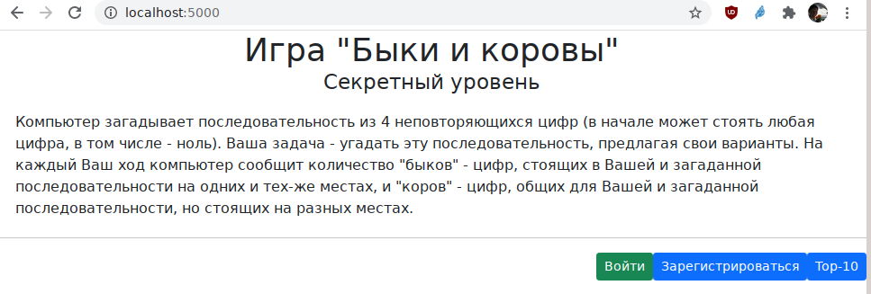
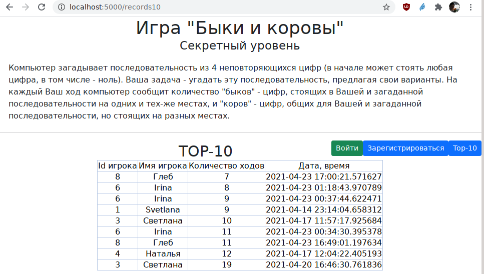
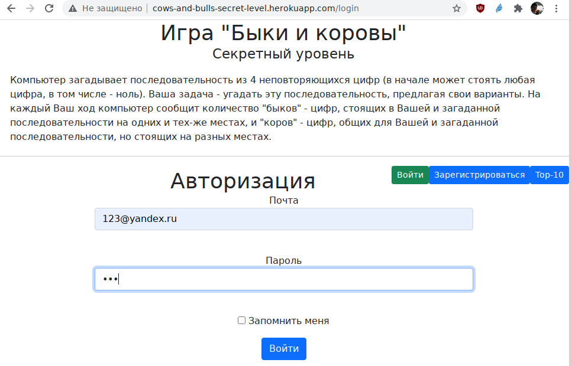
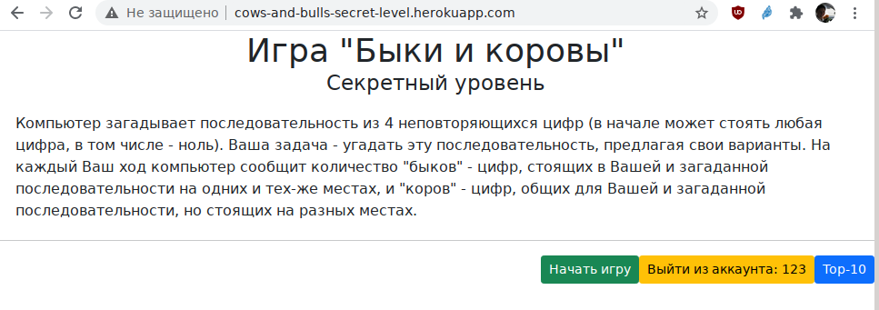
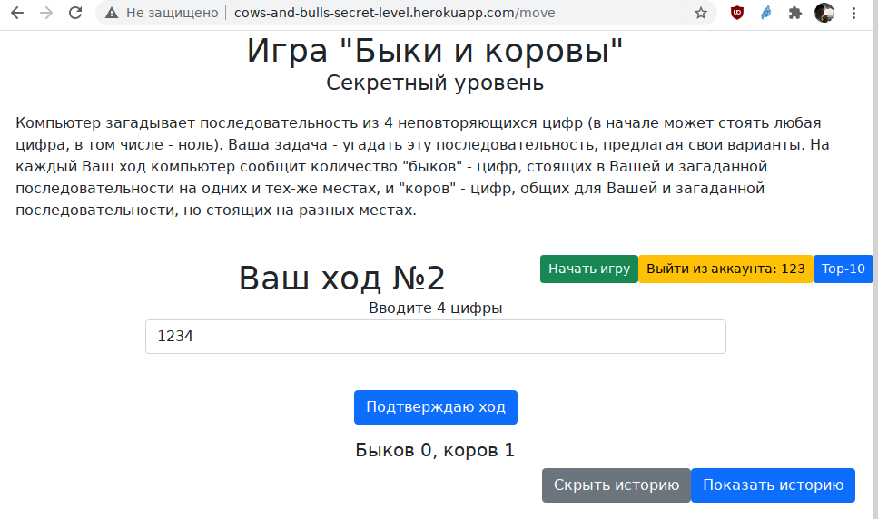
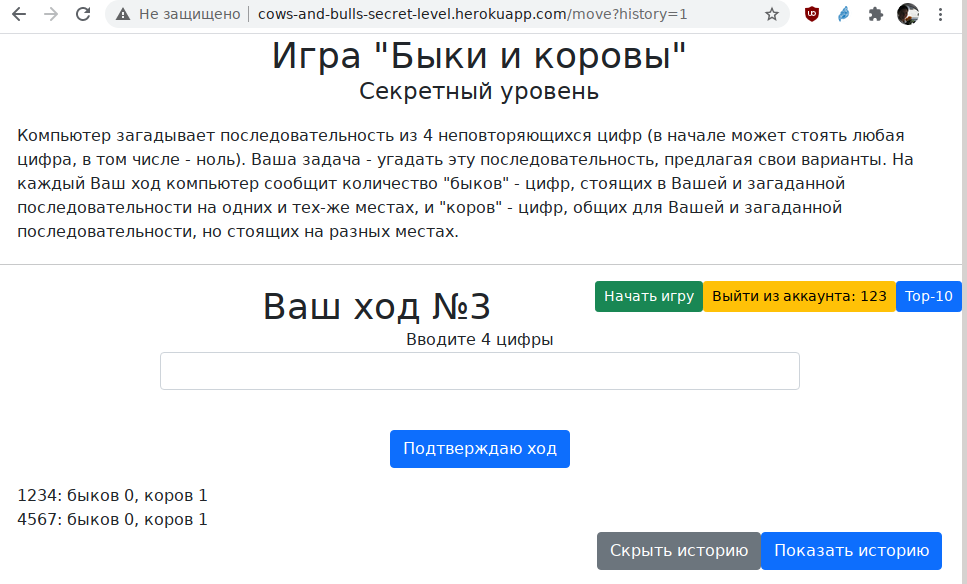
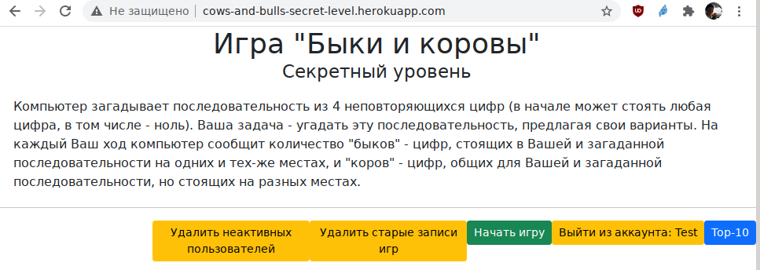
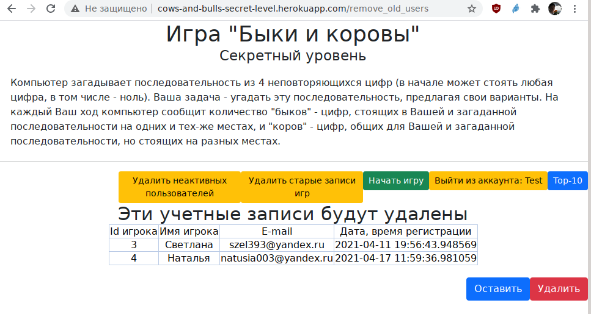

__Игра "Быки и коровы"__

Секретный уровень (условие задачи из первого года обучения в проекте ЯндексЛицей "Ваша задача — написать для этой игры бота, который будет жульничать, играя за загадывающего, и держаться в игре как можно дольше. Секрет бота в том, что когда игрок называет загаданное число, бот должен поменять число так чтобы новое число не противоречило уже данным ответам.
 Дополнительно подумайте, как запрограммировать бота так, чтобы он подменял число не только при точном попадании, а, например, когда совпадает существенная часть цифр. И перезагадывал число так, чтобы про новое число было известно как можно меньше.")
 
Компьютер загадывает последовательность из 4 неповторяющихся цифр (в начале может стоять любая цифра, в том числе - ноль). Ваша задача - угадать эту последовательность, предлагая свои варианты. На каждый Ваш ход компьютер сообщит количество "быков" - цифр, стоящих в Вашей и загаданной последовательности на одних и тех-же местах, и "коров" - цифр, общих для Вашей и загаданной последовательности, но стоящих на разных местах.

После запуска приложения становятся доступны кнопки "Войти", "Зарегистрироваться" и "Тор-10" (записи 10 лучших игр).

Просмотр лучших игр доступен незарегистрированным пользователям.

Форма регистрации достаточно стандартна. При запуске на локальном компьбтере никаких проблем не возникает. При использовании приложения на Heroku регистрация через некоторое время теряется, поэтому для удобства в БД есть тестовые пользователи 123@yandex.ru с паролем 123 и test@yandex.ru с паролем TestAdmin и правами админимтратора.

После входа обычному пользователю становится досткпна игра и выход их аккаунта.

В процессе игры компьютер отслеживает номер хода, причем при неправильном вводе (не 4 цифры, повтор цифр, вообще не цифры, повтор набора в рамках одной игры) будет выдано сообщение об ошибке и номер хода не меняется. Если ход принят, сообщается количество быков и коров.

Можно попросить показать/убрать журнал игры.

Пользователю со статусом администратора (из программы этот статус задать нельзя, вносится в БД "вручную") доступны возможности удаления "старых" игр и "неактивных" пользователей (админимтраторы удалени не подлежат).

Можно подтвердить удаление или оставить все как есть.

По адресу /stat можно получить выгрузку статистики в формате json.

__Технологии в проекте__

Использован Flask, flask_wtf, SqlAlchemy, datetime, os, random и некоторые другие модули (подробнее см. requirements).

База данных в формате sqlite3 состоит из двух таблиц users и records (записи об играх).

Приложение размещено на Heroku по адресу http://cows-and-bulls-secret-level.herokuapp.com/

__Файлы проекта__

В состав проекта входят файлы main.py - основной модуль программы, re_form.py, loginform.py и moveform.py - формы регистрации, входа и ввода числа в игре, папки data с моделями данных (users.py, records.py, __all_models.py) и описанием сессии db_session.py, папки static/css с файлом таблицы стилей, папки templates с файлами шаблонов (base.html - базовый для всех, remove.html - кнопки удалить/оставить, и еще пять шаблонов для разных страниц приложения), папка db с файлом базы данных bulls.db.
